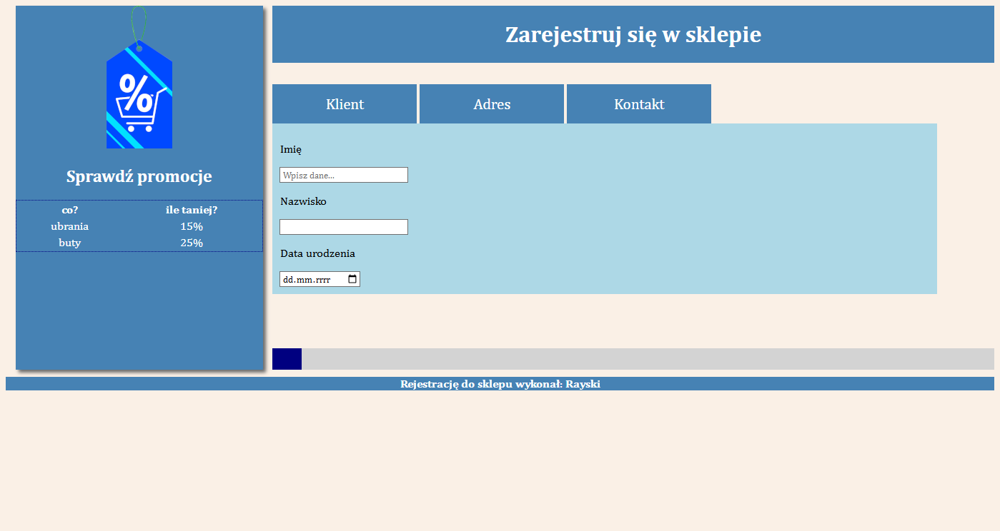

# Sklep rejestracja – projekt z egzaminu INF.03

To moja wersja projektu wykonanego w ramach ćwiczeń do egzaminu zawodowego z kwalifikacji INF.03. Projekt polega na stworzeniu prostego formularza rejestracyjnego z dynamicznym paskiem postępu. Celem było przećwiczenie stosowania pętli `forEach` oraz operacji na tablicach z elementami HTML (`nodeList`). Ze względu na wymogi egzaminacyjne formularz nie posiada walidacji pól.

## Funkcje

- Przełączanie widoczności sekcji formularza
- Zbieranie danych z pól formularza
- Pasek postępu zwiększający się dynamicznie o 12% przy każdym zdarzeniu `focusout`
- Prosty, logiczny kod na pętlach `forEach`

## Technologie użyte w projekcie

- **HTML** – struktura strony
- **CSS** – stylizacja elementów
- **JavaScript (Vanilla)** – logika działania, obsługa zdarzeń i aktualizacja paska postępu

## Jak to działa

- Formularz jest podzielony na sekcje, które można przełączać za pomocą przycisków
- Pasek postępu zaczyna od wartości **4%** i zwiększa się o **12%** po opuszczeniu każdego pola (`focusout`)
- Po kliknięciu przycisku „Zatwierdź” dane z formularza są wypisywane w konsoli przeglądarki

## Zobacz demo

### Podgląd działania

### Link do testu
[Demo zadania egzaminacyjnego](https://rayskidev.github.io/rejestracja-inf03/)
